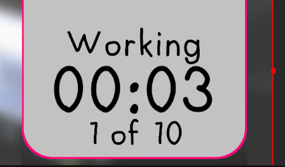
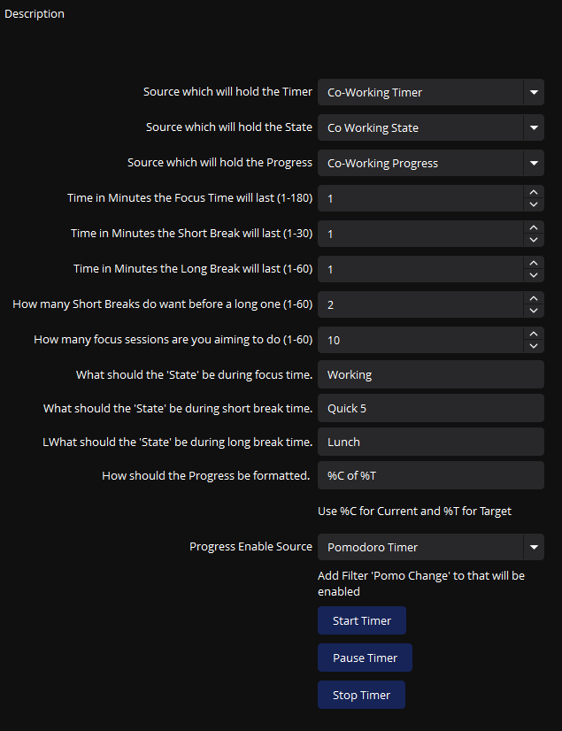
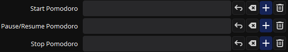
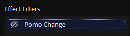

This is an Edited Version of animalshadow's Original Work

- https://obsproject.com/forum/resources/pomodoro-pro-timer-for-obs.1859/

Features:

- Customizable Durations: Tailor your focus, short break, and long break periods to fit your personal productivity rhythm.
- Live Session Counts: Tracks the number of focus sessions completed, providing insights into your work habits.
- Custom Messages: Personalize the display messages for focus time, short breaks, and long breaks to engage and inform your audience.
- Start/Stop Functionality: Take control with simple start and stop buttons, allowing you to manage the timer during live sessions.
- Seamless OBS Integration: Designed as a script for OBS, it integrates smoothly into your existing streaming setup.

# How to Install and Use:​
Installation:

1. Download the Script: Save the LUA script file from the website to your local machine.
2. Open OBS: Launch OBS Studio.
3. Access Scripts: Navigate to the 'Tools' menu and select 'Scripts'.
4. Add the Script: Click the '+' icon and browse to the location of the downloaded LUA script. Select the file to add it to OBS.

Usage:

1. Configure the Text Source: In the script's properties, set the name of the text source where the timer will be displayed.
2. Customize Durations and Messages: Enter your desired focus, short break, and long break durations (in minutes), and customize the display messages according to your preference.
3. Start the Timer: Use the 'Start Timer' button to begin the countdown. The timer will run through focus periods and breaks, updating the text source accordingly.
4. Pause/Stop the Timer: Utilize the 'Stop Timer' button to pause the countdown whenever needed.

## Tips:

- Test the script in a non-live environment to ensure it's configured to your liking.
- Adjust the text source's font, size, and color from within OBS to make the timer visually appealing and readable for your audience.

*Text Copy Pasted from post main function has not really changed* 

# TerrierDarts Edits 

- You now have 3 sources to fully customise how you want it to look 
    * Timer - The Time left
    * State - The State( Working, Break, Paused ECT...)
    * Progress
- Source Menu's are now dropdowns of Text GDI Sources
- Added ability to pause timer
- Added Hotkeys
    * `startPomo`
    * `togglePomo`
    * `stopPomo`

    

- Added Control to Short Break Counts before a long break. 
    * This control means you have X number of small breaks before a long break, so if it was set to 3 you would have 3 short breaks before having 1 long break.
- Control Progress Format with `%C` and `%T`
- Trigger Filter "Pomo Change" on a change.

# To Come
 - Don't let the progress go over, meaning 
